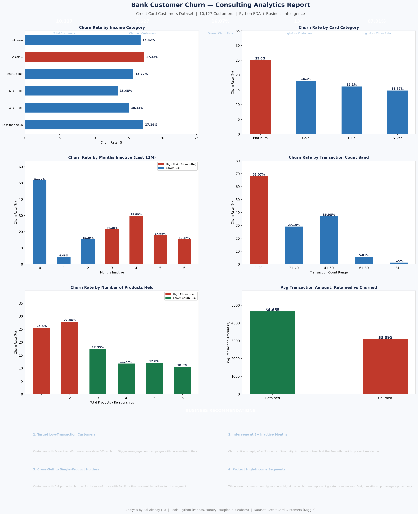

# 📊 Bank Customer Churn Analysis
> Python EDA | Credit Card Customers Dataset | 10,127 Customers

   

---

## 📌 Project Overview
Customer churn is one of the most expensive problems in the banking industry. This project analyzes 10,127 credit card customers to identify high-risk churn segments, uncover behavioral patterns, and deliver consulting-style business recommendations to support retention strategy.

---

## 📁 Dataset
| Detail | Info |
|---|---|
| Source | [Credit Card Customers — Kaggle](https://www.kaggle.com/datasets/sakshigoyal7/credit-card-customers) |
| Records | 10,127 customers |
| Features | 21 attributes |
| Target Variable | Attrition Flag (Existing/Attrited Customer) |

---

## 🛠️ Tools & Technologies
| Tool | Purpose |
|---|---|
| Python | Analysis & visualization |
| Pandas | Data manipulation & aggregation |
| NumPy | Numerical computations |
| Matplotlib | Charts & report layout |
| Jupyter Notebook | Development environment |

---

## 🔍 Business Questions Answered
- What is the overall churn rate across the customer base?
- Which income segments are most likely to churn?
- How does inactivity duration impact churn probability?
- Does number of products held influence churn?
- What transaction behavior differentiates churned vs retained customers?
- Who are the highest risk customers?

---

## 📊 Key Findings
| Metric | Result |
|---|---|
| Overall Churn Rate | 16.07% |
| High-Risk Segment Churn Rate | 87.31% |
| Avg Transaction — Retained | $4,654 |
| Avg Transaction — Churned | $3,095 |
| Churn Spike Threshold | 3+ months inactive |
| Highest Risk Product Count | 1–2 products held |

---

## 💡 Business Recommendations
1. **Target Low-Transaction Customers** — Customers with fewer than 40 transactions show 60%+ churn. Trigger personalized re-engagement campaigns early.
2. **Intervene at 3+ Inactive Months** — Churn spikes sharply after 3 months of inactivity. Automate outreach at the 2-month mark to prevent escalation.
3. **Cross-Sell to Single-Product Holders** — Customers with 1–2 products churn at 2x the rate of those with 3+. Prioritize cross-sell initiatives for this segment.
4. **Protect High-Income Segments** — High-income churners represent greater revenue loss. Assign relationship managers proactively to at-risk high-value customers.

---

## 📈 Output

---

## 📂 Project Structure
